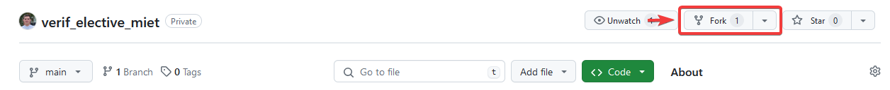
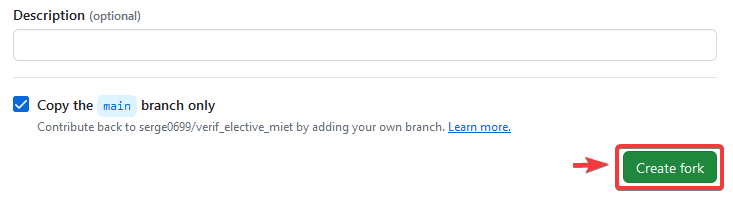
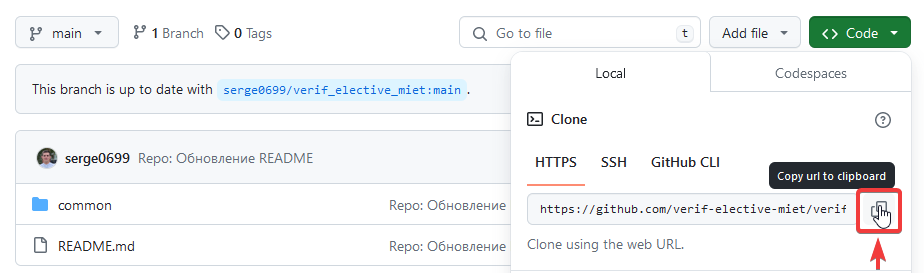
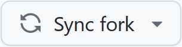
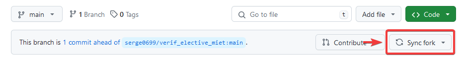
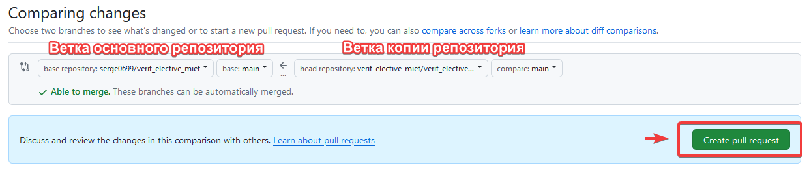
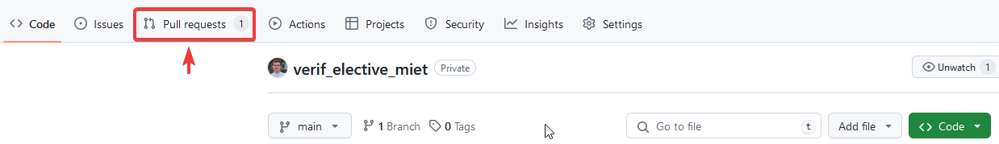
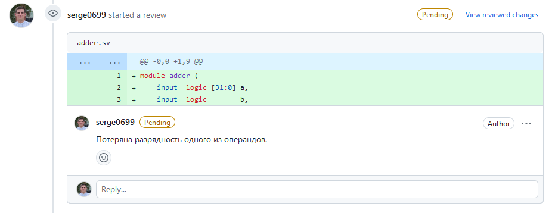

---

- [Об авторе](#об-авторе)
- [Мотивация](#мотивация)
- [О факультативе](#о-факультативе)
  - [FAQ](#faq)
  - [Нужен ли свой ПК](#нужен-ли-свой-пк)
  - [Список необходимого ПО](#список-необходимого-по)
  - [Настройка виртуальной машины](#настройка-виртуальной-машины)
  - [Минимальные требования к знаниям](#минимальные-требования-к-знаниям)
  - [Формат занятий](#формат-занятий)
  - [Домашние задания](#домашние-задания)
- [Работа с репозиторием](#работа-с-репозиторием)
  - [Струтура репозитория](#струтура-репозитория)
  - [Создание копии репозитория](#создание-копии-репозитория)
  - [Обновление копии репозитория](#обновление-копии-репозитория)
  - [Запуск примеров](#запуск-примеров)
  - [Запуск заданий](#запуск-заданий)
  - [Выполнение домашнего задания](#выполнение-домашнего-задания)
- [Взаимодействие с преподавателем](#взаимодействие-с-преподавателем)
  - [Дистанционноая обратная связь](#дистанционноая-обратная-связь)
  - [Обратная связь на домашнее задание](#обратная-связь-на-домашнее-задание)

# Об авторе

Привет, дорогой **единомышленник**! Меня зовут Чусов Сергей Андреевич, я преподаватель в [НИУ МИЭТ](https://miet.ru/), а также инженер по верификации цифровых устройств [НИЛ ЭСК](https://miet.ru/structure/s/3812) в этом же университете. Уже более четырех лет я занимаюсь верификацией цифровых устройств. Имею опыт верификации как отдельных СФ-блоков, так и целых Систем на Кристалле.

# Мотивация


В большинстве ВУЗов (в том числе зарубежных) отсутствуют дисциплины по верификации цифровых устройств. Индустрия продолжает испытывать недостаток специалистов в данной области.

**Данный факультатив призван положить начало развития цикла дисциплин по верификации цифровых устройств** в стенах МИЭТ. Так что мы с вами, уважаемые читатели, стоим у "истоков" и можем смело называть себя первооткрывателями.

# О факультативе

## FAQ

- Нужен ли свой ПК? - [`Нет`](#нужен-ли-свой-пк)
- Какое нужно ПО? - [`Ответ`](#список-необходимого-по)
- Какие минимальные требования к знаниям - [`Ответ`](#минимальные-требования-к-знаниям)
- Дистанционно можно? - `Нет`
- Пропускать занятия можно? - `Да, но зачем?`
- Я получу какой-то сертификат? - `Возможно:)`

## Нужен ли свой ПК

**Если отсутствует ПК для прохождения факультатива - это не проблема**.

Занятия проводятся в компьютерном классе с использованием оборудования НИУ МИЭТ.

## Список необходимого ПО

Необходимо:

- [VirtualBox](#https://www.virtualbox.org/) с [установленной виртуальной машиной](https://files.sberdisk.ru/s/P53je1d7VimaafW) для занятий ([руководство по настройке](#настройка-виртуальной-машины)).

Опционально:

- подключенная общая директория в VirtualBox ([руководство по настройке](https://losst.pro/kak-sdelat-obshhuyu-papku-v-virtualbox));
- [Visual Studio Code](https://code.visualstudio.com/).

## Настройка виртуальной машины

1. [Загрузить архив](https://files.sberdisk.ru/s/P53je1d7VimaafW) с виртуальной машиной;
2. Распакуйте архив;
3. В VirtualBox выберите `Добавить` и укажите файл с расширением `.vbox` из распакованного архива;
4. Запустите ВМ;
5. Введите пароль пользователя: `1234`;
6. Запустите терминал через меню `Applications -> System Tools -> Terminal` и введите команду `vsim`;
7. Если открылось окно QuestaSim и не появилось никаких ошибок, настройка считается успешной, иначае следует [обратиться к преподавателю](#дистанционноая-обратная-связь).

## Минимальные требования к знаниям

- Базовые знания Git ([онлайн курс ~1 час](https://githowto.com/ru));
- Базовые знания цифровой схемотехники и булевой алгебры;
- Базовые знания SystemVerilog.

## Формат занятий

Факультатив состоит из **8 очных занятий на базе НИУ МИЭТ**.  Занятия проходят **в формате диалога**. Каждое занятие разбивается на конкретные темы. Для каждой темы дается теоретическая база, которая обсуждается с присутствующими очно. Далее следует [запуск примеров](#запуск-примеров) и их разбор, а также [выполнение заданий](#выполнение-заданий).

```
... ->  Теория <-> Обсуждение <-> Примеры <-> Задания -> Теория <-> ...
```

Каждый обучающийся в рамках данного факультатива должен прежде всего понимать: преподаватель настроен на то, чтобы передать знания и обучить. **Поэтому любой вопрос по теме является уместным. Высказывайте свое мнение, задавайте вопросы и получайте обратную связь.**  Также после завершения занятия будет выделяться некоторое время на дополнительные вопросы и их обсуждение.

## Домашние задания

После каждого занятия учащимся будет предложено выполнить опциональное домашнее задание с целью закрепления полученных знаний и навыков.

Задание будет формулироваться в конце каждого занятия или через некоторое время после него. Также оно будет дублироваться в файле `README.md` в директории занятия (со структурой репозитрия можно ознакомиться в разделе [струтура репозитория](#струтура-репозитория)).

Процесс выполнения и отправки домашнего задания разобран в разделе [выполнение домашнего задания](#выполнение-домашнего-задания). После отправки студент имеет возможность получить [обратную связь от преподавателя](#обратная-связь-на-домашнее-задание).

# Работа с репозиторием

## Струтура репозитория

Структура репозитория следующая:

- `common` - общие для всех файлы
  - `doc` - документация
  - `pic` - изображения
- `lesson_1` - занятие 1
  - `examples` - примеры
  - `tasks` - задания
  - `README.md` - краткое описание занятия
- `lesson_2` - занятие 2
  - ...
- ...
- `lesson_8` - занятие 8
  - ...
- `README.md` - файл с общей информацией

## Создание копии репозитория

Для того, чтобы работать с репозиторием необходимо создать его копию при помощи кнопки `Fork` в правом верхнем углу главной страницы репозитория.


 В открывшемся после этого окне выбрать `Create fork`.


Теперь в вашем профиле находится копия оригинального репозитория, с которой вы будете работать. Для клонирования вашей копии репозитория в терминале виртуальной машины необходимо выполнить:

1. Переход в корневую директорию:
   ```bash
   cd ~ 
   ```
2. Клонирование копии
   
   Необходимо скопировать https-ссылку из раздела `Code` копии репозитория:
   

   Далее необходимо выполнить:
    ```bash
   git clone <https-ссылка>
   ```
   Например:
   ```bash
   git clone https://github.com/serge0699/verif_elective_miet.git
   ```
## Обновление копии репозитория

Процедура обновления:

1. Обновить копию репозитория при помощи кнопки  главной страницы репозитория:
   

2. Перейти в директорию копии репозитория на виртуальной машины:
   ```bash
   cd ~/verif_elective_miet
   ```
3. Выполнить `pull`:
   ```bash
   git pull
   ```

## Запуск примеров

Команды для запуска примеров будут приведены на слайдах презентации к занятию. В большинстве случаев они будут выглядеть как:

```bash
cd <директория-занятия>/examples
make EXAMPLE=<имя-примера> <аргументы>
```
## Запуск заданий

Команды для запуска заданий в ходе их выполнения будут приведены на слайдах презентации к занятию. В большинстве случаев они будут выглядеть как:

```bash
cd <директория-занятия>/tasks
make EXAMPLE=<имя-примера> <аргументы>
```
## Выполнение домашнего задания

**В ходе выполнения домашнего задания учащемуся необходимо будет дополнить/изменить существующий код на языке SystemVerilog или же написать свой** согласно некоторой документации.

Вся работа будет производиться в копии репозитория ([как создать копию](#создание-копии-репозитория)). Перед выполнением каждого нового задания необходимо обновлять копию репозитория ([как обновить копию](#обновление-копии-репозитория)).

После выполнения задания необходимо применить изменения при помощи `git add` и `git commit`, а также загрузить их на GitHub при помощи `git push`. Ниже представлен пример:

```bash
git add .
git commit -m "Домашнее задание 3"
git push origin main
```

**Если вы не понимаете, что значат эти команды**, то настоятельно **рекомендуется пройти [онлайн курс по Git](https://githowto.com/ru)** длительностью ~1 час.

После того, как выполненное задание загружено на GitHub, необходимо создать запрос на обратную связь при помощи [pull request](https://docs.github.com/ru/pull-requests/collaborating-with-pull-requests/proposing-changes-to-your-work-with-pull-requests/about-pull-requests).


После создания pull request появляется возможность отслеживать его состояние в разделе `Pull requests` основного репозитория.


**Обратную связь преподавателя можно будет увидеть в этом разделе спустя некоторое время.** Процесс исправления недочетов в домашнем задании описан в разделе [обратная связь на домашнее задание](#обратная-связь-на-домашнее-задание).

# Взаимодействие с преподавателем
## Дистанционноая обратная связь

Преподаватель ограниченно [доступен для связи в Telegram](https://t.me/srg_chs). Не стесняйтесь задавать вопросы. Но помните о том, что ответ может быть дан не сразу, а через некоторое время.

## Обратная связь на домашнее задание

После открытия pull request в основной репозиторий появится возможность отслеживать его состояние в разделе `Pull requests` основного репозитория.

Преподаватель в течение некоторого времени оставит комментарии к написанному коду. Пример указания на ошибку:


Задача студента - исправить ошибку и загрузить изменения в копию репозитория. Изменения автоматически отобразятся в открытом pull request. **Не нужно открывать еще один pull request!**

Ситуация с указанием на ошибки и их исправлением может повторяться циклически несколько раз. Если преподаватель считает, что все ошибки исправлены и домашнее задание выполнено корректно - он закрывает pull request. Сообщение об этом выглядит следующим образом:


После этого сообщения домашнее задание считается выполненным корректно.
