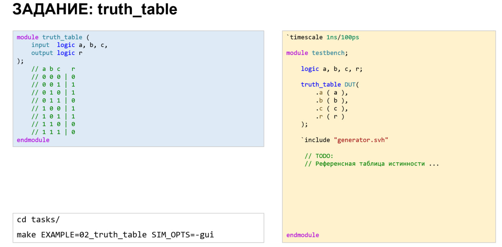

# Домашнее задание к занятию 1

## Задание 1

Проверка модуля, реализующего логическую функцию от 3 переменных. Вся информация находится в файле [lesson_1/tasks/02_truth_table/testbench.sv](https://github.com/serge0699/verif_elective_miet/blob/main/lesson_1/tasks/02_truth_table/testbench.sv). Команда для запуска: `make EXAMPLE=02_truth_table SIM_OPTS=-gui`.

## Задание 2

Проверка [binary to onehot](https://en.wikipedia.org/wiki/One-hot) кодировщика. Вся информация находится в файле [lesson_1/tasks/04_onehot/testbench.sv](https://github.com/serge0699/verif_elective_miet/blob/main/lesson_1/tasks/04_onehot/testbench.sv). Команда для запуска: make `EXAMPLE=04_onehot SIM_OPTS=-gui EXT_POSTFIX=svp`.
