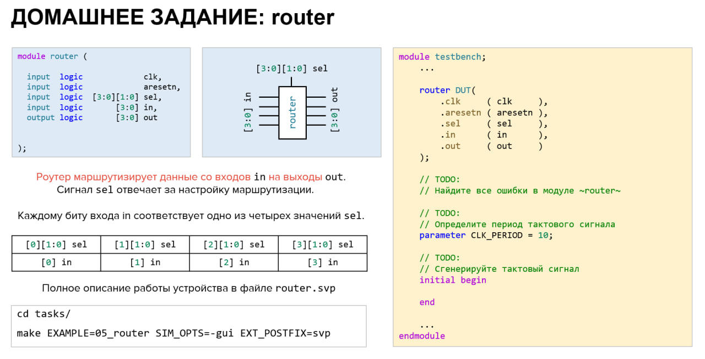

# Домашнее задание к занятию 2

## Задание 1

Проверка модуля маршрутизации данных. Подробное описание работы устройства находится в файле [tasks/05_router/router.svp](https://github.com/serge0699/verif_elective_miet/blob/main/lesson_2/tasks/05_router/router.svp). Задание находится в файле [tasks/05_router/testbench.sv](https://github.com/serge0699/verif_elective_miet/blob/main/lesson_2/tasks/05_router/testbench.sv). Команда запуска: `make EXAMPLE=05_router SIM_OPTS=-gui EXT_POSTFIX=svp`.
