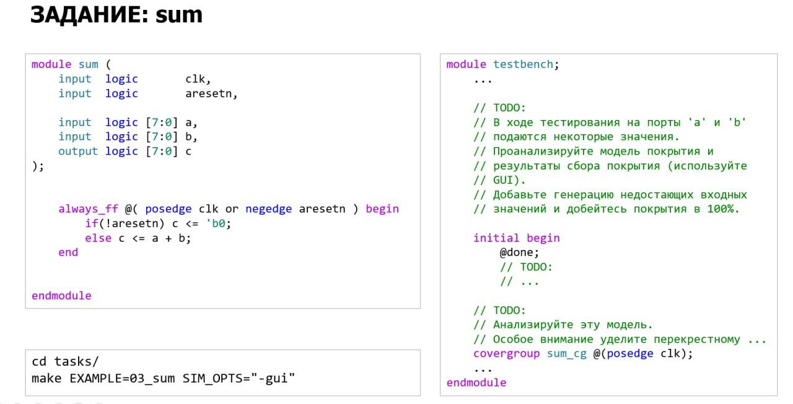

# Домашнее задание к занятию 6

## Задание 1

Необходимо за минимальное количество тактов достичь 100% покрытия модели функционального покрытия, которая представлена в [lesson_6/tasks/03_sum/testbench.sv](https://github.com/serge0699/verif_elective_miet/blob/main/lesson_6/tasks/03_sum/testbench.sv). Дополнительные тестовые воздействия пишутся в специальной TODO-области в этом же файле. Команда запуска: `make EXAMPLE=03_sum SIM_OPTS=-gui`.

Обратите внимание, что уже в базовой версии достигается некоторый процент покрытия. Вам нужно лишь "заполнить пустоты".

В конце симуляции вы увидите сообщение, похожее на: `Cycles for user stimulus: 641`. Число в конце определяет, сколько тактов заняли воздействия пользователя. Вам необходимо добиться минимального количества тактов и при этом достичь 100% покрытия.
